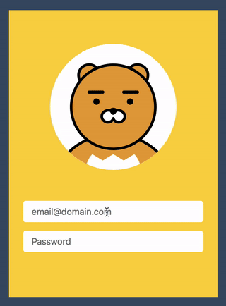

###### SVG 접근성 DEMO

## SVG 그래픽에 접근성을 반영한 라이언 인터랙티브 로그인 버전

[Ryan Login](https://github.com/taggon/ryan-login) 인터랙티브 폼에 사용된 SVG 그래픽에 접근성을 반영한 데모입니다.



## SVG 그래픽에 WAI-ARIA Graphics Module을 반영한 코드

```html
<svg role="graphics-document document" id="ryan" viewBox="0 0 120 120" xmlns="http://www.w3.org/2000/svg">

  <title>라이언</title>
  <desc>사용자의 타이핑에 따라 인터랙션으로 작동하는 라이언 그래픽입니다.</desc>

  <g role="graphics-symbol img" aria-label="몸통">
    <path d="M0,150 C0,65 120,65 120,150" fill="#e0a243" stroke="#000" stroke-width="2.5" />
    <path d="M40,105 C10,140 110,140 80,105 L80,105 L70,111 L60,105 L50,111 L40,105" fill="#fff" />
  </g>

  <g role="graphics-object group" aria-label="귀" class="ears">
    <desc>이메일을 입력할 때와 달리, 패스워드를 입력할 때는 뒤로 젖혀집니다. 마치 패스워드는 안 보겠다는 것처럼.</desc>
    <path d="M46,32 L46,30 C46,16 26,16 26,30 L26,32" fill="#e0a243" stroke="#000" stroke-width="2.5" stroke-linecap="round"
      transform="rotate(-10,38,24)" />
    <path d="M74,32 L74,30 C74,16 94,16 94,30 L94,32" fill="#e0a243" stroke="#000" stroke-width="2.5" stroke-linecap="round"
      transform="rotate(10,82,24)" />
  </g>

  <g role="graphics-object group" aria-label="얼굴">
    <circle data-comment="얼굴" cx="60" cy="60" r="40" fill="#e0a243" stroke="#000" stroke-width="2.5" />
    <g role="graphics-object group" aria-label="눈" class="eyes">
      <desc>이메일을 입력할 때 눈은 아래 방향으로 향하지만, 패스워드를 입력할 때는 위 방향으로 향합니다.</desc>
      <g role="graphics-symbol img" data-comment="눈썹과 눈동자(왼쪽)">
        <line x1="37" x2="50" y1="46" y2="46" stroke="#000" stroke-width="3" stroke-linecap="round" />
        <circle cx="44" cy="55" r="3" fill="#000" />
      </g>
      <g role="graphics-symbol img" data-comment="눈썹과 눈동자(오른쪽)">
        <line x1="70" x2="83" y1="46" y2="46" stroke="#000" stroke-width="3" stroke-linecap="round" />
        <circle cx="76" cy="55" r="3" fill="#000" />
      </g>
    </g>
  </g>

  <g role="graphics-object group" aria-label="코와 입" class="muzzle">
    <desc>이메일을 입력할 때는 좌우로 움직이지만, 패스워드를 입력할 때는 뒤로 젖혀진 채 좌우로 움직입니다.</desc>
    <g role="graphics-symbol img" data-comment="입">
      <path d="M60,66 C58.5,61 49,63 49,69 C49,75 58,77 60,71 M60,66 C61.5,61 71,63 71,69 C71,75 62,77 60,71" fill="#fff" />
      <path d="M60,66 C58.5,61 49,63 49,69 C49,75 58,77 60,71 M60,66 C61.5,61 71,63 71,69 C71,75 62,77 60,71" fill="#fff" stroke="#000" stroke-width="2.5" stroke-linejoin="round" stroke-linecap="round" />
    </g>
    <polygon data-comment="코" points="59,63.5,60,63.4,61,63.5,60,65" fill="#000" stroke="#000" stroke-width="5" stroke-linejoin="round" />
  </g>

</svg>
```

## License

본 프로젝트 코드의 기반이 된 코드 저작권은 [김태곤](https://github.com/taggon) 개발자에게 있음을 알려드립니다.