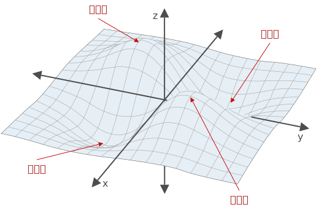
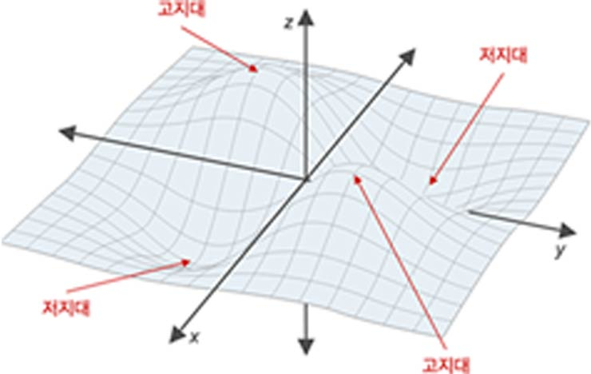
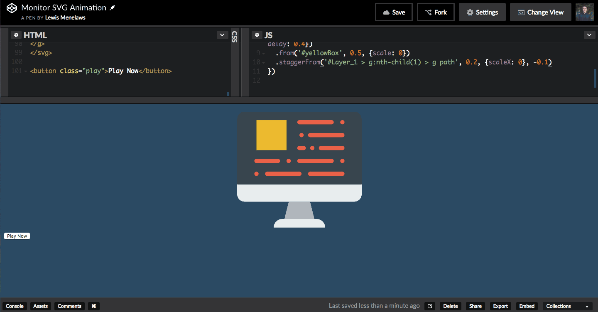
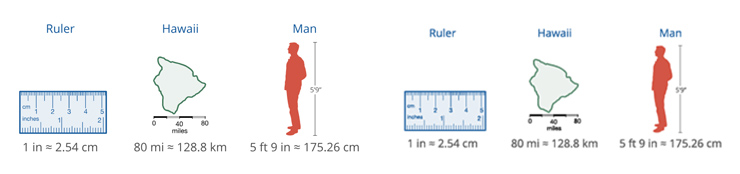

# SVG

## 1. 소개

SVG는 많은 웹 접근성 이점을 제공하는 강력한 웹 기술입니다. 접근성을 염두에 두고 구조화 된 방식으로 만들 수 있기 때문에 SVG를 사용하여 콘텐츠용 이미지, 그래프를 만듭니다. 또한 SVG는 모든 최신 데스크톱 및 모바일 브라우저에서 지원됩니다.

## 2. 가이드라인

이 가이드라인은 W3C [SVG 1.1 2번째 에디션](https://www.w3.org/TR/SVG11/) 사양과 [SVG 접근성 기능](https://www.w3.org/TR/SVG-access/)에서 제시한 내용을 정리한 것입니다. 이 문서에서 다루는 내용은 여러 브라우저(Chrome, Firefox, IE 등)에서 테스트 되었습니다. 이 문서는 모범 사례(Best Practice)가 개선되면 업데이트 됩니다.

## 3. SVG란?

SVG는 Scalable Vector Graphics의 약자입니다. "SVG는 2차원 그래픽 애플리케이션과 이미지, 관련 그래픽 스크립트 인터페이스 집합을 기술하기 위한 마크업 언어입니다."

기본적으로 웹에서 확장 가능한 그래픽을 만들기 위한 구조화 된 XML 이미지 형식[1](https://www.w3.org/Graphics/SVG/) 입니다. [SVG 콘텐츠]() 섹션에서 SVG의 주요 접근성 기능에 대해 자세히 설명합니다.

SVG의 구조화 된 특성(본질)은 보조 기술(Assistive Technologies)이 PNG, JPEG 이미지 보다 이미지 내용을 탐색(navigate) 하거나, 분석(parse)하기 쉽도록 합니다. 정적 이미지는 일반적으로 SVG의 전체 구조를 사용하지 않지만, 보조 기능 사용자가 의도한 방식으로 이미지를 경험할 수 있도록 이러한 기능을 염두에 두고 인터랙션 되거나, 애니메이션 되는 이미지를 만들 수 있습니다.

## 4. SVG를 사용하는 이유

SVG를 사용하여 접근성을 높이는 것이 보다 쉬울 뿐만 아니라, 기존 이미지 포멧(예: PNG, JPEG) 보다 파일 크기가 작기 때문에 웹 성능이 크게 향상 될 수 있습니다. 게다가 스크린 크기를 확대해도 선명함을 유지하기에 로고, 아이콘, 인포 그래픽 요소 등에 사용하기 적합합니다.

#### 확장성(Scalability)

SVG는 반응성(Responsive)이 좋아 아무리 크기를 키워도 선명함이 유지됩니다. 브라우저 배율을 확대해서 SVG 이미지와 다른 이미지(예: PNG, JPEG) 포멧을 비교해보세요.

<small>SVG는 벡터(Vector) 그래픽 포멧으로 이미지를 확대해도 선명도가 유지됩니다.</small>

 

<small>JPEG, PNG는 래스터(Raster) 그래픽 포멧으로 이미지를 확대하면 픽셀이 보이고 뿌옇게 보입니다.</small>

#### 표준화(Standardization)

SVG는 XML 기반 언어로 사람이 코드를 읽기 쉽고, 수정이 가능하고 하나의 원형 그래픽을 여러 개로 만들 수 있습니다. 디자이너는 `<defs>` 요소를 통해 이미지 컴포넌트(예: 축 화살표)의 심볼(Symbol) 디자인을 정의한 후, 해당 심볼 이미지를 `<use>` 요소를 사용해 재사용 할 수 있습니다. 뿐만 아니라 CSS를 사용하여 스타일을 설정할 수 있습니다.

#### 동적(Dynamic) 처리

**수정 가능(Modifiable)** - SVG 코드를 편집하지 않고 CSS를 사용해 SVG 비주얼 디자인을 변경할 수 있습니다. 뿐만 아니라 SVG는 JavaScript, CSS 애니메이션을 사용해 컨트롤 가능한 애니메이션을 구현할 수 있습니다.

<small>CSS를 통해 실시간 동적 수정이 가능합니다.</small>  

<small>JavaScript 애니메이션을 사용해 멋진 결과물을 구현할 수 있습니다.</small>  

 
<small>SVG 애니메이션이 반영된 웹 사이트 디자인은 멋진 동적 인터페이스를 사용자에게 제공합니다.</small>

 

**라이브 텍스트** - SVG 텍스트는 마크업의 일부이므로 브라우저는 다른 텍스트처럼 화면에 렌더링 합니다. 즉, 사용자가 마우스로 긁어 선택할 수 있을 뿐더러 보조 기술로도 읽을 수 있음을 의미합니다. 래스터 기반의 전동적인 이미지 포멧(예: PNG, JPEG)에 그려진 텍스트는 픽셀로 구성됩니다. 다시 말해 텍스트는 정적 이미지의 일부로 마우스로 긁어 선택하거나 보조 기술로 읽을 수 없습니다. 뿐만 아니라 화면이 확대되었을 때 글자가 뿌옇게 보입니다.

<small>SVG 텍스트(왼쪽)와 달리 래스터 이미지 텍스트(오른쪽)는 보조 기술로 읽을 수 없습니다.</small>

 
 
 

---

> 원문: [hawkeslearning.com/Accessibility](http://www.hawkeslearning.com/Accessibility)