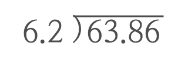

# SVG 접근성

콘텐츠 접근성 관점에서 볼 때, 전통적인 래스터 이미지(예: JPEG, PNG) 포멧보다 SVG는 다양한 장점을 제공합니다.
이러한 장점은 일반 사용자와 저시력, 전맹 시각 장애인에게 향상된 접근성을 제공할 수 있습니다.

1. `<defs>` 요소를 사용하여 시각적 객체의 템플릿(재사용 목적)을 만들 수 있습니다.
1. 이미지의 관련 부분을 그룹(`<g>`)화 하고 표준 SVG 마크업을 사용하여 해당 그룹을 설명(`<desc>`) 할 수 있습니다.
1. SVG 이미지 안에 배치된 `<text>` 요소는 읽기 쉬울 뿐더러 마우스로 긁어 선택/복사 가능합니다.
1. SVG 이미지는 확대해도 다른 이미지 포멧과 달리 선명합니다.

<br>

<details>
  <summary>목차 <small>(목차를 보려면 ▶︎ 화살표를 클릭하세요.)</small></summary>

  - [SVG 기초](#svg-기초)
    - [SVG 요소](#svg-요소)
      - [네임스페이스(Namespace)](#네임스페이스namespace)
      - [뷰박스(viewBox)](#뷰박스viewbox)
      - [너비(Width)와 높이(Height)](#너비width와-높이height)
    - [SVG 제목과 설명](#svg-제목과-설명)
    - [템플릿 정의(`<defs>`) 및 사용(`<use>`) 요소](#템플릿-정의defs-및-사용use-요소)
      - [`<defs>` 요소](#defs-요소)
      - [`<use>` 요소](#use-요소)
    - [그룹(`<g>`) 요소](#그룹g-요소)
    - [ARIA를 사용해 그룹 내용 감추기](#aria를-사용해-그룹-내용-감추기)
    - [패스(`<path>`) 요소](#패스path-요소)
        - [moveto (M/m)](#moveto-mm)
        - [closepath (Z/z)](#closepath-zz)
      - [선 그리기 명령](#선-그리기-명령)
        - [Lineto (L/l)](#lineto-ll)
        - [Horizontal Line (H/h)](#horizontal-line-hh)
        - [Vertical Line (V/v)](#vertical-line-vv)
        - [선을 연결하여 도형 그리기 명령](#선을-연결하여-도형-그리기-명령)
    - [SVG 텍스트](#svg-텍스트)
      - [Text Anchor 요소](#text-anchor-요소)
      - [T-Span 요소](#t-span-요소)
        - [T-Span 요소 사용 시, 주의할 점](#t-span-요소-사용-시-주의할-점)
    - [트랜스포메이션(변형, Transformations)](#트랜스포메이션변형-transformations)
      - [이동(Translate)](#이동translate)
      - [크기 변형(Scale)](#크기-변형scale)
        - [미러 이미징(Mirror Imaging)](#미러-이미징mirror-imaging)
      - [회전(Rotation)](#회전rotation)
      - [비틀기(Skew)](#비틀기skew)
    - [참고자료](#참고자료)
</details>

<br>

## SVG 기초

일반적으로 SVG를 구성하는 기본 구조는 다음과 순서로 작성됩니다.

```html
<svg>

  <!-- SVG 타이틀, 설명 -->
  <title> ... </title>
  <desc> ... </desc>

  <!-- 재사용을 위한 템플릿 -->
  <defs>
    ...
  </defs>

  <!-- 그룹(묶음) -->
  <g aria-hidden="true">
    <g>
      <path />
      <!-- 라이브 텍스트 -->
      <text> ... </text>
    </g>
  </g>

</svg>
```

<br>

### SVG 요소

`<svg>` 요소는 SVG의 시작입니다. `svg` 요소에 추가 할 수 있는 속성은 다양합니다만, 일반적으로 `xmlns`, `xmlns:xlink`, `viewbox`, `width`, `height` 속성이 설정됩니다.

#### 네임스페이스(Namespace)

W3C: XML 네임스페이스(Namespace)는 URI 참조로 식별되는 네임스페이스와 연결하여 확장 가능한 마크업 언어로 작성된 문서에서 사용된 요소, 속성 이름을 한정하는 간단한 방법을 제공합니다. 우리가 사용할 네임스페이스는 다음과 같습니다.

    xmlns       = "http://www.w3.org/2000/svg"
    xmlns:xlink = "http://www.w3.org/1999/xlink"

#### 뷰박스(viewBox)

모든 SVG 요소는 유형에 관계없이 `viewbox` 속성을 가져야 합니다. `viewbox` 속성은 화면에 SVG 요소가 어떻게 그려질지 설정하기 때문입니다. 값을 변경하면 SVG 전체 또는 일부를 표시 할 수 있습니다. 또는 축소, 확대 할 수도 있습니다. `viewbox`에는 공백으로 구분하여 4개의 매개 변수를 설정할 수 있습니다. 일반적으로 최솟값은 `0`으로 설정하고 폭과 높이는 SVG의 너비와 높이 값으로 설정합니다.

    viewbox = "min-x y-min-y width height"

#### 너비(Width)와 높이(Height)

`width`, `height` 속성은 SVG의 실제 크기를 결정합니다. `viewbox` 속성과 함께 사용하면 다양한 디스플레이 유틸리티를 제공할 수 있습니다. 설정된 SVG 코드는 다음과 같습니다.

```html
<svg xmlns=http://www.w3.org/2000/svg
     xmlns:xlink="http://www.w3.org/1999/xlink"
     viewBox="0 0 520 520">
</svg>
```

<br>

### SVG 제목과 설명

`<title>` 요소는 제목을 나타내고 툴팁(Tooltip)으로 표시되며 일반 텍스트로만 작성해야 합니다.

`<desc>` 요소는 설명을 나타냅니다. `title` 및 `desc`는 HTML의 `alt` 및 `longdesc` 속성과 비슷합니다. 이 설정을 통해 보조 기술(AT) 사용자의 접근성을 향상 시킬 수 있습니다. 다음은 `title`, `desc` 요소를 추가한 좌표계 예시입니다.

```html
<svg
  xmlns="http://www.w3.org/2000/svg"
  xmlns:xlink="http://www.w3.org/1999/xlink"
  viewBox="0 0 520 520">

    <title>직교 좌표계(Cartesian coordinate) 평면</title>
    <desc>동일한 길이 축이 있는 표준 직교 좌표계입니다.</desc>

</svg>
```

화면에 그려진 그래픽을 통해 알 수 있듯이 `title` 및 `desc` 요소 내용은 화면에 표시되지 않습니다. 하지만 보조 기술에서는 해당 내용을 읽을 수 있습니다.


SVG의 또 다른 이점은 MathML 요소를 `<desc>` 요소에 삽입 할 수 있다는 것 입니다. 다음은 `<desc>` 요소에 MathML을 사용 하여 선 방정식을 나타내는 예 입니다.
이 방법으로 실제 방정식을 방정식의 시각적 표현을 구성하는 모양이나 선에 대한 설명으로 사용할 수 있습니다.


```html
<title>데카르트 그래프 및 수식 예제</title>
<desc>선 방정식은 다음과 같습니다.
  <math>
    <mi>y</mi>
    <mo>=</mo>
    <mrow>
      <mrow>
        <mn>2</mn>
        <mo>&#x2062;</mo>
        <mi>x</mi>
      </mrow>
      <mo>+</mo>
      <mn>2</mn>
    </mrow>
  </math>. 통과하는 포인트 중 두 개는
  <math>
    <mo>(</mo>
    <mrow>
      <mn>0</mn>
      <mo>,</mo>
      <mn>3</mn>
    </mrow>
    <mo>)</mo>
  </math> 와
  <math>
    <mo>(</mo>
    <mrow>
      <mrow>
        <mo>&#x2212;</mo>
        <mn>2</mn>
      </mrow>
      <mo>,</mo>
      <mrow>
        <mo>&#x2212;</mo>
        <mn>1</mn>
      </mrow>
    </mrow>
    <mo>)</mo>
  </math>.
</desc>
```

<br>

### 템플릿 정의(`<defs>`) 및 사용(`<use>`) 요소

#### `<defs>` 요소

`<defs>` 요소는 나중에 재사용 될 템플릿 요소를 정의하는데 사용됩니다. `<marker>`와 같은 일부 재사용될 템플릿 요소는 `<defs>` 요소 내에 작성해야 합니다. `<defs>` 내부에 존재하는 템플릿 요소는 `<use>` 요소를 사용해 재사용할 수 있습니다. 아래 예는 문서 전반에 걸쳐 사용된 다양한 화살표 마커(markers)를 정의합니다. `<defs>` 요소 내에 포함된 것들은 화면에 그려지지 않습니다.

```html
<svg
  xmlns="http://www.w3.org/2000/svg"
  xmlns:xlink="http://www.w3.org/1999/xlink"
  viewBox="0 0 520 520"
  width="250" height="250">

  <title>Def 요소 사용 예시</title>
  <desc>
    각 축에 사용된 화살표 마커를 사용하기 위한 정의이며, 이 마커들은
    직교 그래프(Cartesian Graph)와 숫자 라인(Numberline)에서 사용(use) 됩니다.
  </desc>

  <!-- 재사용 가능할 템플릿 요소 정의 -->
  <defs>
    <marker id="axisArrowheadStart" orient="auto" viewBox="0 0 10 10" refX="10" refY="5" markerWidth="7.5" markerHeight="7.5">
      <path class="fill" d="M10,0 L0,5 L10,10z" />
    </marker>
    <marker id="axisArrowheadEnd" orient="auto" viewBox="0 0 10 10" refX="0" refY="5" markerWidth="7.5" markerHeight="7.5">
      <path class="fill" d="M0,0 L10,5 L0,10z" />
    </marker>
  </defs>

</svg>
```

`<defs>` 요소 내에 정의된 템플릿 요소의 ID 속성 값을 참조를 사용하여 재사용 할 수 있습니다. 이 템플릿을 통해 재사용된 이미지는 일관성을 보장 할 수 있습니다. 이렇게 하면 웹 페이지 로드 시간이 줄어들고 제작자는 템플릿 제작에 집중할 수 있습니다.

참고로 `<defs>`에 정의된 템플릿은 하나의 SVG 요소 내에서만 사용될 수 있는 것은 아닙니다. 템플릿 정의가 페이지에 포함되면 해당 페이지의 모든 SVG 요소 내에서 템플릿을 참조하여 재사용 할 수 있습니다. 여러 개의 SVG 요소가 있는 페이지의 경우 각 SVG에 대해 동일한 템플릿 정의를 반복하고 싶지는 않을 겁니다. 이러한 경우 첫 번째 SVG 요소 내 `<defs>` 요소 내에 정의할 템플릿을 모두 정의합니다. 이렇게 하면 각 SVG가 사용하는 정의를 명확히 하면서 중복되는 코드 양을 줄일 수 있습니다.

#### `<use>` 요소

`<use>` 요소를 사용하면 `<defs>` 요소 내에 정의된 템플릿을 재사용 할 수 있습니다. `xlink:href` 속성을 사용해  정의된 템플릿 ID 속성을 통해 참조가 가능합니다. 코드 양을 줄이고 시간을 절약하는 좋은 방법입니다. 적절한 레이아웃 및 크기 조정을 위해 `width`, `height` 및 `x`, `y` 개별 속성을 `<use>` 요소에 설정할 수 있습니다.

아래의 예는 `<use>`와 `<defs>` 요소를 `<path>` 같은 다른 요소와 결합하여 새로운 이미지를 만드는 다양한 방법을 보여줍니다.


```html
<!-- 재사용 템플릿 정의 -->
<defs>
  <path id="blueLine" class="line stroke2 primaryStroke" d="M0 0 h100" />
  <path id="redLine" class="line stroke2 secondaryStroke1" d="M0 0 h100" />
</defs>

<!-- 재사용 -->
<use xlink:href="#redLine" x="90" y="50" />
<use xlink:href="#blueLine" x="70" y="80" />
<path class="line stroke2 secondaryStroke2" d="M 50 110 h100" />
```

빨간색, 파란색 선은 `<defs>` 요소 내에 정의된 "blueLine", "redLine" ID 값이 설정된 `<path>`로부터  만들어졌습니다. 반면 녹색 선은 `<path>` 요소를 사용하여 템플릿을 사용하지 않고 직접 그린 것입니다. 2가지 방법 중 하나를 사용해 이미지를 만들 수 있지만, `<use>` 요소를 사용하는 것이 보다 코드를 간결하게 만들어 줍니다.

<br>

### 그룹(`<g>`) 요소

`<g>` 요소를 사용해 여러 요소를 묶을 수 있습니다. `<g>` 요소에 의해 묶여진 그룹은 의미적으로 연결되며 이미지를 구현하기 위한 계층 구조가 만들어 집니다. 의미적으로 묶인 그룹은 SVG 코드를 체계화 합니다. 데카르트 그래프의 경우 점과 그 좌표(x, y)가 의미적으로 연결되어 하나의 이미지로 묶이게 됩니다.

`<g>` 그룹 요소에 고유한 식별자를 할당하는 방법은 2가지입니다.

첫번째 방법은 `<defs>` 요소에 포함되어 있을 때 `id` 속성을 할당하는 것입니다. `id` 속성을 그룹 요소에 설정하면 추후 그룹을 참조 할 수 있는 쉬운 방법이 되며, 적절한 이름을 지정하면 그룹의 구성을 알기 쉽습니다. `id` 속성 값은 공백을 포함해서는 안됩니다. 공백이 포함되면 문법 오류이기 때문이죠. 단어를 구분지을 필요가 있는 경우 하이픈(`-`), 언더스코어(`_`), 카멜케이스(`camelCase`) 방법 중 하나를 택해 설정합니다.

```html
<g id="그룹-ID">
```

두번째 방법은 `<defs>` 요소에 포함되어 있지 않을 때 그룹을 식별하기 위한 코멘트를 추가하는 방법입니다.

```html
<g data-comment="코멘트">
```

모든 그룹이 ID 또는 코멘트를 필요로 하는 것은 아니지만, SVG 코드가 복잡할 경우 매우 유용합니다. 단, ID와 코멘트 이름은 문서 내에 중복되면 안되며 고유한 이름을 가져야 합니다. 아래 예제를 살펴봅시다.


```html
<g data-comment="좌표와 점">
  <g data-comment="점(1, 3)">
    <use xlink:href="#cartesianDot1" x="284" y="188" />
    <text class="svgMath" x="310" y="190">(1, 3)</text>
  </g>
  <g data-comment="점(4, 6)">
    <use xlink:href="#cartesianDot1" x="356" y="116" />
    <text text-anchor="end" class="svgMath" x="340" y="110">(4, 6)</text>
  </g>
  <g data-comment="점(-2, 0)">
    <use xlink:href="#cartesianDot1" x="212" y="260" />
    <text text-anchor="end" class="svgMath" x="220" y="240">(−2, 0)</text>
    </g>
  <g data-comment="점(-4, -2)">
    <circle class="secondaryFill1" cx="164" cy="308" r="8" />
    <text text-anchor="end" class="svgMath" x="150" y="310">(−4, −2)</text>
  </g>
</g>
```

그래프의 각 점과 좌표 정보를 묶음으로서 의미적으로 하나의 이미지로 연결하였습니다. 만약 각 점이 아닌 모든 점과 좌표 정보를 묶게 된다면 사용자에게 혼란을 야기시키는 결과를 초래합니다.

<br>

### ARIA를 사용해 그룹 내용 감추기

`<title>`, `<desc>`을 통해 충분한 콘텐츠를 이미 제공했다면? WAI-ARIA `aria-hidden` 속성을 그룹 요소에 적용해 그룹 내용을 스크린리더에서 중복해서 읽지 않게 설정할 수 있습니다. 아래 예제를 살펴보세요.



```html
<svg
  xmlns="http://www.w3.org/2000/svg"
  xmlns:xlink="http://www.w3.org/1999/xlink"
  viewBox="0 0 250 250"
  height="250" width="250">

  <title>ARIA를 사용해 그룹을 감추는 예제</title>
  <desc>아래 긴 설명 대신 내용을 알기 쉽게 요약하여 스크린리더가 읽게 만듬</desc>

  <!-- aria-hidden="true" 설정으로 스크린리더가 그룹에 감싸진 내용을 읽지 않게 설정 -->
  <g aria-hidden="true">
    <g data-comment="스크린리더가 중복해서 읽을 콘텐츠">
      <text text-anchor="middle" class="svgMath" x="60" y="40" dy="0 0 0 0 -2">6.2 )</text>
      <path class="line stroke1" d="M 77.25 19 h77" />
      <text text-anchor="middle" class="svgMath" x="120" y="40">63.86</text>
    </g>
  </g>

</svg>
```

<br>

### 패스(`<path>`) 요소

`<path>` 요소는 선을 그리거나 윤곽선을 그리는데 사용되며 설정 가능한 다양한 속성이 있습니다. 패스 데이터는 `d` 속성에 설정합니다. `d` 속성에 설정할 수 있는 세부 명령은 `moveto(M/m)`, `lineto(L/l)`, `horizontal line(H/h)`, `vertical line(V/v)`, `closepath(Z/z)` 및 커브(Curve, [SVG Pocket Guide 참고](https://github.com/jonitrythall/svgpocketguide/blob/master/svgpocketguide.md#user-content-curve-commands))을 포함합니다. 이러한 명령은 필요할 경우 반복적으로 사용될 수 있습니다.

##### moveto (M/m)

패스 데이터는 `moveto` 명령으로 시작해야 합니다 . `moveto` 명령은 종이 위에 그림을 그리기 위해 점을 찍을 위치를 설정하는 것과 같습니다.

##### closepath (Z/z)

`closepath` 명령은 현재 진행 중인 패스를 끝내고 닫힌 현재 점까지 직선을 그립니다.

#### 선 그리기 명령

##### Lineto (L/l)

`lineto` 명령은 가장 많은 유틸리티를 가지고 있으며 한 지점에서 다른 지점으로 선을 그립니다.

##### Horizontal Line (H/h)

`horizontal line` 명령은 현재 점에서 지정된 점까지 수평선을 왼쪽 또는 오른쪽 방향(x축)으로 그립니다.

##### Vertical Line (V/v)

`horizontal line` 명령은 현재 점에서 지정된 점까지 수직선을 위 또는 아래 방향(y축)으로 그립니다.

##### 선을 연결하여 도형 그리기 명령

여러 선이나 곡선(curves)을 `<path d="...">` 데이터로 묶어 복잡한 도형을 그릴 수 있습니다. 아래 예제를 살펴봅시다. 삼각형 이미지는 `moveto` 명령으로 시작해서 선을 연결해 그려졌습니다. 3개의 대각선은 동일한 패스 데이터를 가지지만, `moveto` 명령을 사용해 새로운 점으로 이동한 다음 선을 그렸습니다.


```html
<g aria-hidden="true">
  <path class="line stroke2 noFill" d="M50 60 l 30 50 h-60 l 30 -50" />
  <path class="line stroke2 noFill" d="M150 60 l 30 50 M160 60 l 30 50 M170 60 l 30 50" />
</g>
```

대문자는 절대 위치를 나타내며 소문자는 상대 위치를 나타냅니다. 일반적으로 절대 위치 지정 보다 상대 위치 지정을 사용하는 것이 더 편리합니다. 상대 위치 지정을 사용하면 나중에 필요할 경우 코드를 쉽게 리팩토링 할 수 있습니다.

이 아이디어는 아래 예에서 확인할 수 있습니다. 위 삼각형들은 원본이며 왼쪽 삼각형은 상대적 위치 지정을 사용하여 생성되고 오른쪽은 절대 위지 지정되었습니다. 아래 삼각형들은 원본을 복사해 위치 변경(Drag Copy)한 삼각형입니다.

아래에 위치한 삼각형들 중 왼쪽 삼각형 `d` 속성 값을 확인하면 원본 삼각형(왼쪽)의 M(`moveTo`) 값의 y값만 60에서 120 으로 변경하면 됩니다. 상대 위치 지정을 한 삼각형이기 때문이죠. 반면 절대 위지 지정된 삼각형(오른쪽)은 모든 y 값을 변경해야 합니다. 이것이 복잡한 패스 데이터를 가진 `<path>`를 조작해야 할 때, 상대 위치 지정을 사용하는 것이 보다 편리한 이유입니다.


```html
<g aria-hidden="true">

  <g data-comment="원본 삼각형">
    <!-- 소문자 명령은 상대 위치 설정 -->
    <path
      data-comment="상대 위치 설정된 삼각형 (왼쪽 위 삼각형)"
      d="M50 60 l 30 50 h -60 l 30 -50" />
    <!-- 대문자 명령은 절대 위치 설정 -->
    <path
      data-comment="절대 위치 설정된 삼각형 (오른쪽 위 삼각형)"
      d="M150 60 L 180 110 H 180 120 L150 60 " />
  </g>

  <g data-comment="위치가 변경된 삼각형">
    <path
      data-comment="상대 위치 설정된 삼각형 (왼쪽 아래 삼각형)"
      d="M50 120 l 30 50 h -60 l 30 -50" />
    <path
      data-comment="절대 위치 설정된 삼각형 (오른쪽 아래 삼각형)"
      d="M150 120 L 180 170 H 180 120 L150 120 " />
  </g>

</g>
```

<br>

### SVG 텍스트

SVG 이미지 내에 실제 텍스트를 사용할 수 있습니다. 이러한 텍스트는 래스터 이미지(예: PNG, JPEG) 포멧에 포함된 텍스트 보다 접근성이 우수합니다. 텍스트 콘텐츠는 `<text>` 요소 안에 넣을 수 있으며 SVG 뷰포트의 `x` 및 `y` 좌표를 토대로 배치 할 수 있습니다.

`<text>` 요소의 텍스트는 화면에 표시 되고 보조 기술에 의해 읽혀집니다. `<text>` 요소가 감싼 텍스트는 부모 요소에 `aria-hidden="true"` 속성이 설정되지 않는 이상 읽는데 문제가 없습니다. `<tspan>` 요소는 `<text>` 요소를 SVG 뷰포트의 다른 위치에 배치하는데 사용됩니다.

[Authoring Accessible SVGs](http://schepers.cc/authoring-accessible-svg) 글에서는 SVG에서 텍스트를 정렬하는데 `<text>` 요소와 `<tspan>` 요소를 사용하는 방법에 대한 훌륭한 설명을 제공하지만 보조 기술 사용자에게도 동일한 정보를 제공합니다.

#### Text Anchor 요소

`text-anchor` 속성은 SVG에 배치되는 텍스트와 관련하여 `x`, `y` 좌표의 위치를 결정합니다. 이 속성은 텍스트와 상관없이 항상 사용되어야 합니다. `start`, `middle`, `end` 3가지 식별자 중 하나를 사용할 수 있습니다.

다른 요소의 오른쪽에 텍스트를 배치 할 때는 `start`를 사용하고, 다른 요소의 왼쪽에 텍스트를 배치 할 때는 `end`를 사용합니다. 그리고 요소 바로 위 또는 아래에 텍스트를 레이블하려면 `middle`을 사용합니다. 이러한 설정은 텍스트의 크기가 커지는 것을 허용하면서 레이블링 되는 요소가 겹쳐지지 않도록 합니다. 텍스트 앵커 속성은 다음과 같습니다.

- `text-anchor="start"` 
- `text-anchor="middle"` 
- `text-anchor="end"`

아래는 `text-anchor` 속성에 대한 각기 다른 사용 예시를 개괄적으로 보여 줍니다. 좌표 (-2, 1) 및 (2, -2)는 해당 지점 바로 위, 아래에 레이블이 있기 때문에 `text-anchor="middle"` 속성을 사용합니다. "Text1" 텍스트는 라인의 왼쪽에 위치해 있기 때문에 `text-anchor="end"` 속성을 사용합니다. "Text2" 텍스트는 오른쪽에 위치해 있기 때문에 `text-anchor="start"` 속성을 사용합니다.


#### T-Span 요소

`<tspan>` 요소는 SVG의 텍스트와 관련하여 여러 인스턴스에서 사용될 수 있습니다. HTML의 `<span>`과 유사합니다. `<text>` 요소 일부 글자 그룹만 스타일을 지정하거나 이동하려면 `<tspan>` 요소에 적절한 클래스 속성을 설정해 디자인 합니다. 속성 `dx`, `dy`는 이전 텍스트와 비교하여 모든 방향으로 값을 이동하는데 사용될 수 있습니다. 이것은 지수(exponents) 및 각도(degree) 심볼을 사용할 때 유용 할 수 있습니다.


##### T-Span 요소 사용 시, 주의할 점

텍스트 요소 내에서 요소의 위치를 변경하기 위해 `<tspan>` 요소를 사용할 때 `<tspan>` 요소의 위치 변경은 `<tspan>` 요소에 포함된 내용이 아닌 동일한 `<text>` 요소 내에 포함된 이후 모든 항목에 적용된다는 것을 기억해야 합니다. `<tspan>` 요소 위치를 조정하려면 `dx`, `dy` 값을 사용합니다. 아래 예시는 잘못된 `<tspan>` 사용과 관련된 올바른 `<tspan>`에 대해 보여줍니다.


```html
<g data-comment="정확한 tspan">
  <!-- text-anchor="end": 왼쪽에 위치 -->
  <text x="150" y="30" text-anchor="end">정확한 tspan:</text>
  <!-- text-anchor="start": 오른쪽에 위치 -->
  <text class="svgMath primaryFill" text-anchor="start" x="170" y="30">
    <!-- tspan 요소에 설정된 dy 값을 통해 글자 위치 조정 -->
    2<tspan class="italic">x</tspan><tspan class="fontSmall" dy="-14">2</tspan><tspan dy="14"> + 4<tspan class="italic">x</tspan> + 5</tspan>
  </text>
</g>

<g data-comment="공백이 과도한 tspan">
  <text x="150" y="90" text-anchor="end">공백 오류:</text>
  <text class="svgMath primaryFill" text-anchor="start" x="190" y="90">
    2<tspan class="italic"> x </tspan><tspan class="fontSmall" dy="-14"> 2 </tspan><tspan dy="14"> + 4 <tspan class="italic"> x </tspan> + 5</tspan>
  </text>
</g>

<g data-comment="기준선이 어긋난 tspan">
  <text x="150" y="150" text-anchor="end">기준선 오류:</text>
  <text class="svgMath primaryFill" text-anchor="start" x="190" y="150">
    2<tspan class="italic">x</tspan><tspan class="fontSmall" dy="-14">2</tspan>+ 4<tspan class="italic">x</tspan> + 5
  </text>
</g>
```

<br>

### 트랜스포메이션(변형, Transformations)

SVG 요소를 이전 상황과 다르게 변형해야 한다면 변형(Tranformations) 속성을 사용할 수 있습니다. 예를 들어 요소를 이동 시키고자 한다면 SVG 뷰포트에 상대적 또는 절대적인 위치를 `x` 또는 `y` 값으로 설정합니다.

SVG 요소를 변형하려면 `transform="변형 유형"` 속성을 사용합니다. 변형 속성은 이동(`translate()`), 크기 변형(`scale()`), 회전(`rotate()`), 비틀기(`skew()`) 등을 사용할 수 있습니다. 이 외에도 행렬(`matrix()`)을 사용할 수도 있지만 복잡한 행렬 시스템에 대해 이해해야만 사용할 수 있습니다.

변형을 공부하기 위해 간단한 예제를 다룰 겁니다. 보다 자세한 내용은 [MDN Transform Page](https://developer.mozilla.org/en-US/docs/Web/SVG/Attribute/transform) 글을 통해 공부해보세요.
그리고 뷰박스(View Boxes), 변형(Transformations)에 대한 자세한 설명이 필요하면 [Soueidan의 블로그: SVG Tranformations](http://sarasoueidan.com/blog/svg-transformations/) 글이 도움이 될겁니다.

요소에 적용되는 모든 변형은 해당 요소의 좌표 시스템을 변경합니다. 예를 들어 어떤 요소를 이동(Translate)하면 새로운 좌표 시스템이 반영 적용됩니다.

#### 이동(Translate)

첫번째로 알아볼 SVG 변형은 이동(Translate)입니다. 코드는 다음과 같습니다.

`transform="translate(x[, y])"`

이동은 `x`와 `y` 값을 전달하여 설정합니다. `y` 값은 옵션으로 설정되지 않으면 0으로 간주됩니다. `x="10"`, `y="10"`으로 그려진 `<rect>` 요소를 오른쪽으로 100px 만큼, 아래쪽으로 35px 만큼 이동하려면 `x="110"`, `y="45"`로 재설정해야 하는데 반해 `translate(x, y)`를 사용하면 상대적 이동이 간단해 사용이 편리합니다.
그리고 그룹에 적용해 이동시키면 요소를 개별적으로 이동시킬 필요 없이 한 번에 이동 가능해 매우 유용합니다.

아래는 이동된 사각형 예제를 보여줍니다.


```html
<g data-comment="원본 사각형">
  <rect x="10" y="10" width="50" height="50" class="line noFill stroke1" />
  <text
    class="svgMath fontSmall"
    text-anchor="start" x="75" y="35">이동하기 전, 사각형</text>
</g>

<g data-comment="이동된 사각형">
  <rect x="10" y="10" width="50" height="50" class="secondaryStroke1 noFill stroke1"
    transform="translate(100,35)" />
  <text
    class="svgMath fontSmall secondaryFill1"
    text-anchor="start" x="175" y="70">이동한 이후, 사각형</text>
</g>
```

#### 크기 변형(Scale)

두 번째로 알아볼 변형은 크기 변형(Scale)입니다. 코드는 다음과 같습니다.

`transform="scale(x[, y])"`

크기 변형은 `x`와 `y` 값을 전달하여 설정합니다. `y` 값은 옵션으로 설정되지 않으면 `x` 값과 같다고 가정합니다.

요소 크기를 변형하면 배율이 요소에 반영된다는 점에 유의하세요. 예를 들어 `scale(2)`로 변형 설정된 `<rect>` 요소가 있다면, 사각형 좌상단 모서리를 기준으로 `x`, `y` 좌표에 2를 곱한 값이 적용됩니다. 이전 `x`, `y` 좌표 값이 20이면 크기 변형 후 새 좌표는 40이 됩니다. 테두리 선 두께 또한 변경됩니다.


```html
<g data-comment="원본 사각형">
  <rect x="20" y="20" width="50" height="50" class="line noFill stroke1" />
  <text class="svgMath fontSmall" text-anchor="start" x="85" y="35">
    크기 조정 이전, 사각형
  </text>
</g>

<g data-comment="크기 변형된 사각형">
  <rect x="20" y="20" width="50" height="50" class="secondaryStroke1 noFill stroke1"
        transform="scale(2)" />
  <text class="svgMath fontSmall secondaryFill1" text-anchor="start" x="155" y="95">
    크기 조정 이후, 사각형
  </text>
</g>
```

`<rect>` 요소의 좌상단 모서리를 같은 지점에 유지하려면 `translate()`를 사용하여 이전 좌표와 새 좌표 간의 차이 만큼 이동시켜야 합니다. 아래 예제를 살펴봅시다.


```html
<g data-comment="원본 사각형">
  <rect x="20" y="20" width="50" height="50" class="gridline noFill stroke1" />
</g>

<g data-comment="크기 변형된 사각형">
  <rect x="20" y="20" width="50" height="50" class="secondaryStroke1 noFill stroke1"
        transform="scale(2)" />
  <text class="svgMath fontSmall secondaryFill1" text-anchor="start" x="155" y="95">
    크기 변형 후, 이동은 하지 않은 사각형
  </text>
</g>

<g data-comment="크기 변형 후 이동된 사각형">
  <rect x="20" y="20" width="50" height="50" class="primaryStroke noFill stroke1"
        transform="scale(2) translate(-10,-10)"/>
  <text class="svgMath fontSmall primaryFill" text-anchor="start" x="130" y="30">
    크기 변형 후, 이동한 사각형
  </text>
</g>
```

##### 미러 이미징(Mirror Imaging)

`scale`, `translate`를 조합해 사용하면 이미지를 축을 기준으로 미러링(반사, Mirroring) 할 수 있습니다.  방법은 미러링 하려는 방향으로 `scale` 값을 `-1` 적용한 다음, `translate`를 사용해 이동해주면 됩니다. 아래 예제를 살펴보세요.


```html
<g data-comment="반사의 기준 축(파선)">
  <path d="M250 0 v100" class="gridline stroke1 dashed" />
  <text class="svgMath fontSmall" x="250" y="115" text-anchor="middle">
    라인 미러링(반사)
  </text>
</g>

<g data-comment="원본 패스">
  <path d="M10 60 C15 150 35 50 240 70" class="primaryStroke stroke2 noFill" />
</g>

<g data-comment="반사된 패스">
  <path d="M10 60 C15 150 35 50 240 70" class="primaryStroke stroke2 noFill"
        transform="scale(-1,1) translate(-500 0)" />
</g>
```

#### 회전(Rotation)

다음으로 알아볼 변형은 회전(Rotation)입니다. 코드는 다음과 같습니다.

`transform="rotate(a[, x, y])"

`x`, `y` 값으로 정의된 점을 기준으로 `a` 각도 만큼 회전합니다. `a`는 회전 각도(degree)를 나타내며 양수(시계 방향) 또는 음수(반 시계 방향)으로 설정 가능합니다. `x`, `y` 값은 옵션으로 설정되지 않을 경우, 기본 기준점(좌상단 모서리)을 기준으로 회전합니다.

참고로 `<rect>` 요소를 `x`, `y` 좌표 설정 없이 25도 회전을 적용하면 `<rect>` 자체가 아닌 SVG 뷰포트 복사본이 만들어져 25도 회전하게 됩니다.


```html
<g data-comment="원본 사각형">
  <rect x="250" y="10" width="50" height="50" class="line noFill stroke1" />
  <text class="svgMath fontSmall" x="240" y="40" text-anchor="end">
    회전하기 이전, 사각형
  </text>
</g>

<g data-comment="회전된 사각형">
  <rect x="250" y="10" width="50" height="50" class="secondaryStroke1 noFill stroke1"
        transform="rotate(25)" />
  <text class="svgMath fontSmall secondaryFill1" x="275" y="155" text-anchor="start">
    회전한 이후, 사각형
  </text>
</g>
```

그래서 `<rect>` 요소 중심을 기준으로 회전시키려면, 요소의 중심점(`x`, `y`) 좌표 설정을 옵션으로 전달해야 합니다.


```html
<g data-comment="Rotated Rectangle with x and y specified">
  <rect x="250" y="10" width="50" height="50" class="primaryStroke noFill stroke1"
        transform="rotate(25,275,35)" />
  <text class="svgMath fontSmall primaryFill" text-anchor="start" x="290" y="85">
    x, y축을 중심으로 회전시킨 사각형
  </text>
</g>
```

#### 비틀기(Skew)

마지막으로 알아볼 변형은 비틀기(Skew)입니다만, 그렇게 유용하지는 않습니다. 코드는 다음과 같습니다.

- `transform="skewX(a)"`
- `transform="skewY(a)"`

x 또는 y 축 중 하나를 선택하여 비틀 수 있습니다. 아래 예제를 살펴보세요.


```html
<g data-comment="원본 사각형">
  <rect x="10" y="10" height="50" width="75" class="stroke1 line noFill" />
  <text class="svgMath fontSmall" x="90" y="40" text-anchor="start">
    skewX를 적용하기 전, 사각형
  </text>
</g>

<g data-comment="X축으로 비튼 사각형" transform="translate(-30, 0)">
  <rect x="10" y="90" height="50" width="75" class="stroke1 line secondaryStroke1 noFill"
        transform="skewX(20)" />
  <text x="135" y="120" text-anchor="start" class="svgMath fontSmall secondaryFill1">
    skewX를 적용한 사각형
  </text>
</g>
```


```html
<g data-comment="원본 사각형">
  <rect x="10" y="10" height="50" width="75" class="stroke1 line noFill" />
  <text class="svgMath fontSmall" x="90" y="40" text-anchor="start">
    skewY를 적용하기 전, 사각형
  </text>
</g>

<g data-comment="Y축으로 비튼 사각형">
  <rect x="10" y="90" height="50" width="75" class="stroke1 line secondaryStroke1 noFill"
        transform="skewY(20)" />
  <text x=90 y="150" text-anchor="start" class="secondaryFill1 svgMath fontSmall">
    skewY를 적용한 사각형
  </text>
</g>
```

<br>

### 참고자료

- [Joni Trythall's SVG Pocket Guide](https://github.com/jonitrythall/svgpocketguide/blob/master/svgpocketguide.md)
- [W3C Namespaces</a>](https://www.w3.org/TR/REC-xml-names/)
- [W3C Website (General SVG Reference)</a>](https://www.w3.org/TR/#tr_SVG/)
- [Authoring Accessible SVGs</a>](http://schepers.cc/authoring-accessible-svg)
- [Soueidan's Blog: SVG Tranformations</a>](http://sarasoueidan.com/blog/svg-transformations/)
- [MDN SVGs (General Reference)</a>](https://developer.mozilla.org/en-US/docs/Web/SVG/)
- [MDN Transform Page</a>](https://developer.mozilla.org/en-US/docs/Web/SVG/Attribute/transform/)
- [SVG vs PNG Magnification</a>](https://www.w3.org/TR/SVG-access/#What)

<br>

---

> 원문: [hawkeslearning.com/Accessibility](http://www.hawkeslearning.com/Accessibility)